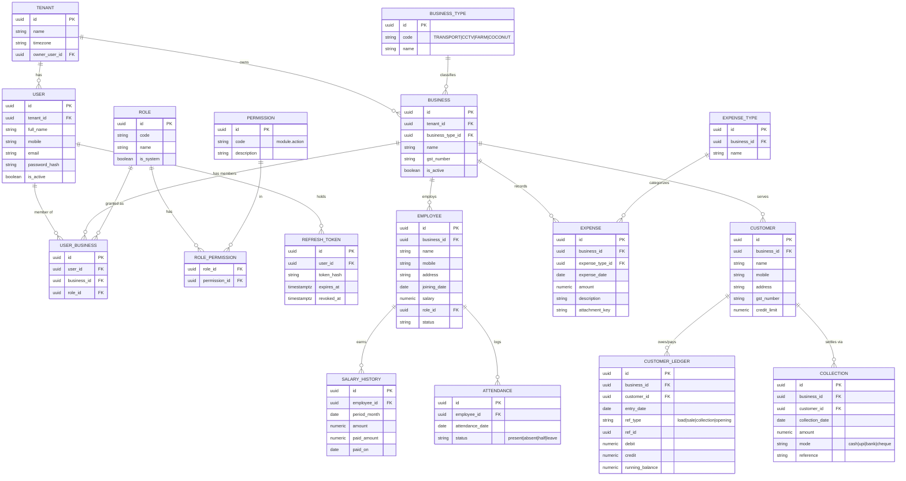
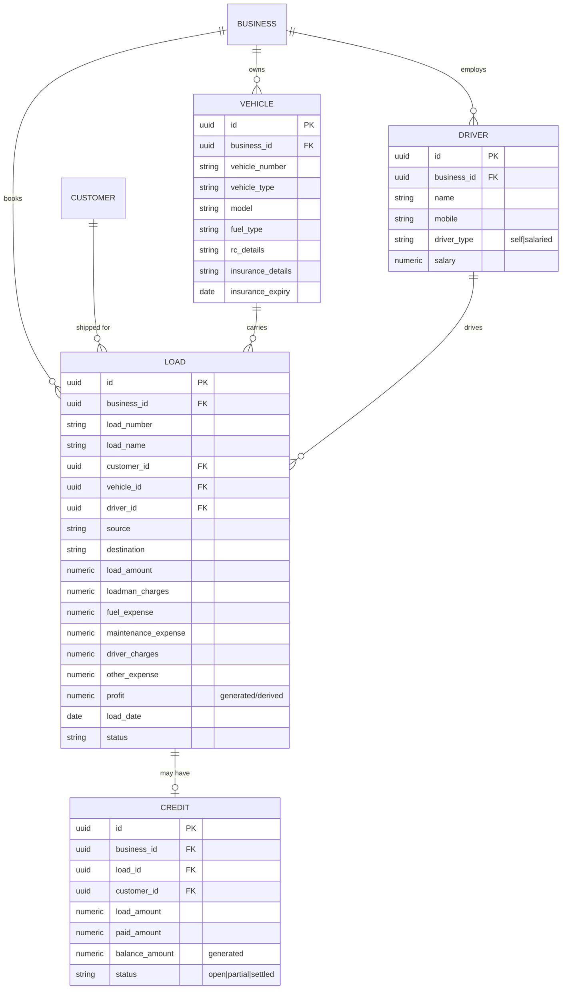
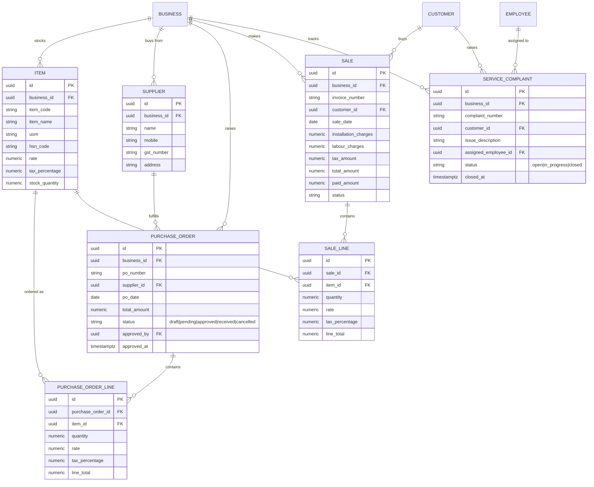
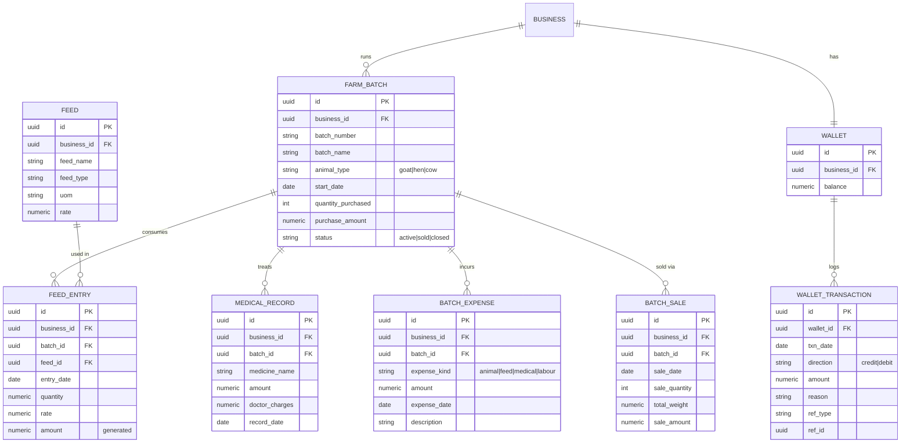
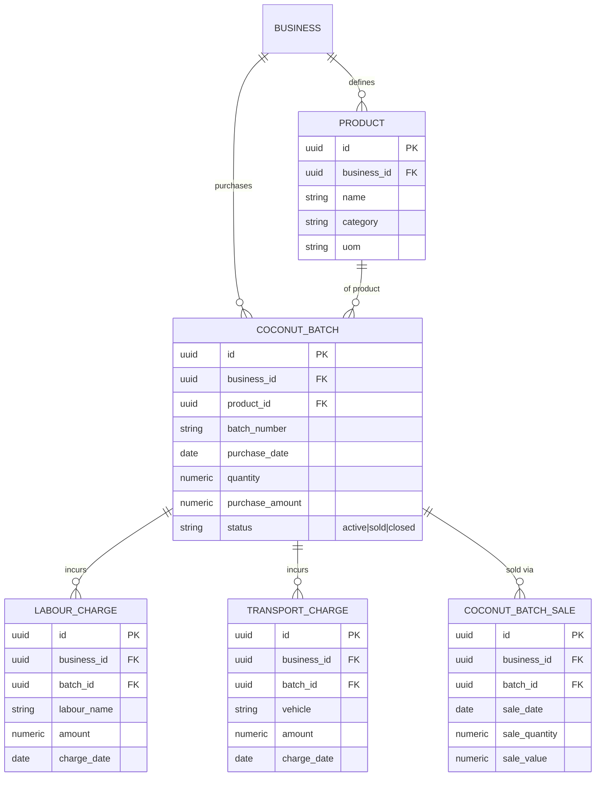
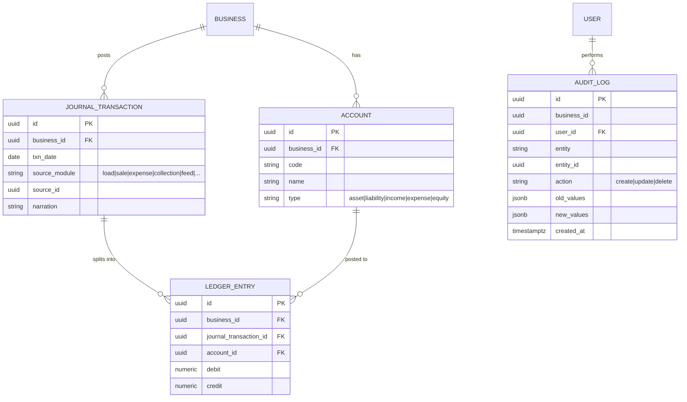

# 04 · Database Design — ER Diagram & Data Dictionary

PostgreSQL 15. Conventions: `snake_case`; UUID primary keys (`uuid` default `gen_random_uuid()`);
money `numeric(14,2)`; timestamps `timestamptz` (UTC); soft delete + audit columns on every
business table. The tenant discriminator is `business_id` on every business-scoped table.

> The runnable DDL is in [05-database-scripts.sql](05-database-scripts.sql). This file is the
> conceptual model + the human-readable data dictionary.

## 1. Audit/soft-delete columns (on every business table)

| Column | Type | Notes |
|--------|------|-------|
| `id` | uuid PK | `gen_random_uuid()` |
| `created_at` | timestamptz | not null, default `now()` |
| `created_by` | uuid | FK → users.id (nullable for system) |
| `updated_at` | timestamptz | nullable |
| `updated_by` | uuid | FK → users.id (nullable) |
| `is_deleted` | boolean | not null default false |
| `deleted_at` | timestamptz | nullable |

These are omitted from per-table dictionaries below for brevity (assume present).

## 2. ER Diagram — Identity, Tenancy & Common modules

## 3. ER Diagram — Business 1: Goods Transport

**Load Profit** = `load_amount − (fuel_expense + maintenance_expense + driver_charges +
loadman_charges + other_expense)`. Stored as a Postgres **generated column** so it can never
drift from the inputs.

## 4. ER Diagram — Business 2: Electronics & CCTV

## 5. ER Diagram — Business 3: Farm Management

**Batch P&L** = `Σ batch_sale.sale_amount − (purchase_amount + Σ feed + Σ medical + Σ labour)`.
Computed by a query/view (`v_farm_batch_pnl`), not stored, because expenses accrue over time.

## 6. ER Diagram — Business 4: Coconut Business

**Coconut Profit** = `Σ sale_value − (purchase_amount + Σ labour + Σ transport)`.
View: `v_coconut_batch_pnl`.

## 7. ER Diagram — Accounting & Audit (cross-business)

Each financial event (a load, a sale, an expense, a collection, a feed purchase) **also** posts a
balanced `journal_transaction` with two-or-more `ledger_entry` rows. This is what powers the
Cash Book, Ledger, and P&L reports uniformly across all four verticals.

## 8. Data dictionary — selected non-obvious fields

| Table.Column | Type | Rule / meaning |
|--------------|------|----------------|
| `business.business_type_id` | uuid FK | Immutable after first transaction; drives module visibility |
| `load.profit` | numeric generated | `load_amount − sum(all expenses)`; cannot be written directly |
| `credit.balance_amount` | numeric generated | `load_amount − paid_amount`; check `paid_amount ≤ load_amount` |
| `item.stock_quantity` | numeric | Maintained by triggers/handlers on PO-receive (+) and Sale (−) |
| `purchase_order.status` | enum text | State machine: draft→pending→approved→received / cancelled |
| `service_complaint.status` | enum text | open→in_progress→closed; `closed_at` set on close |
| `wallet.balance` | numeric | = `Σ credit − Σ debit` of wallet_transactions (reconciled) |
| `attendance.status` | enum text | present / absent / half / leave; one row per employee per day (unique) |
| `customer_ledger.running_balance` | numeric | Maintained per customer in date order |
| `audit_log.old/new_values` | jsonb | Snapshot diff for compliance |

## 9. Indexing strategy (summary)

- Every business table: index on `business_id`, and composite `(business_id, <date>)` for the
  date-range reports that dominate the workload.
- Unique constraints scoped by tenant: `unique(business_id, vehicle_number)`,
  `unique(business_id, item_code)`, `unique(business_id, batch_number)`,
  `unique(business_id, invoice_number)`, `unique(employee_id, attendance_date)`.
- Foreign-key columns indexed (PostgreSQL does not auto-index FKs).
- Partial index `WHERE is_deleted = false` on hot tables.
- `audit_log`: index `(entity, entity_id)` and `(business_id, created_at)`.

Full constraints and indexes are in [05-database-scripts.sql](05-database-scripts.sql).
